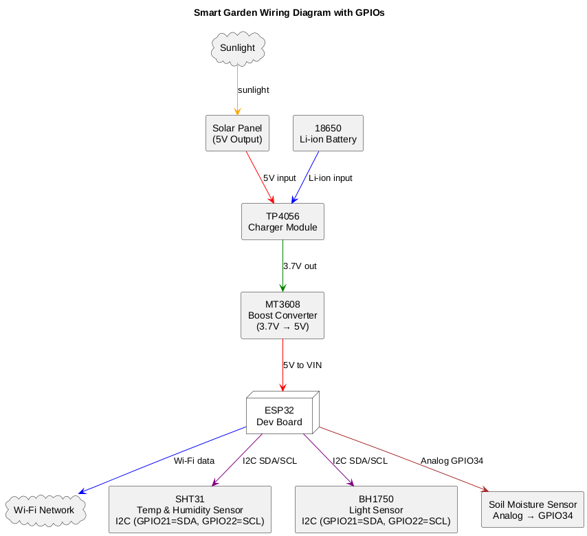
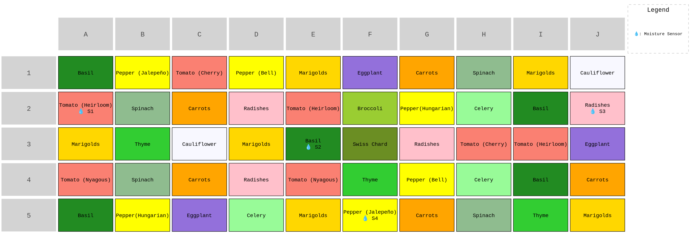

# 🌱 Smart Garden AIoT System

This is an ESP32-powered smart garden system designed for small-scale agriculture monitoring. It integrates IoT sensors (soil moisture, temperature, humidity, light) with solar power and AI-ready architecture for future expansion.

## 🔧 Features

- Soil moisture monitoring (capacitive sensor)
- Ambient temperature and humidity tracking (SHT31)
- Light intensity measurement (BH1750)
- Power via 18650 Li-ion battery + TP4056 + MT3608 + solar panel
- Serial output logging (for now — cloud & dashboard support coming)
- Easily extendable to include irrigation control, weather alerts, or ML analysis

## 📦 Hardware Components

```
| Component            | Description                           |
|----------------------|---------------------------------------|
| ESP32 Dev Board      | Main microcontroller with Wi-Fi       |
| SHT31                | Temperature + humidity sensor         |
| BH1750               | Light intensity sensor (lux)          |
| Soil Moisture Sensor | Capacitive type (analog)              |
| TP4056               | Li-ion battery charger module         |
| MT3608               | Boost converter (3.7V → 5V)           |
| 18650 Battery        | Power source                          |
| Solar Panel (5V 1W+) | Recharges battery                     |
```

## 💻 Software Overview

- Written in Arduino C++
- Modular sensor code: `sensors/` directory
- Serial monitoring via USB or UART
- Supports deep sleep modes for power saving (in development)

## 📁 Folder Structure

```
smart-garden/
├── firmware/
│   ├── main/
│   │   └── main.ino
│   └── sensors/              # Modular .h/.cpp for each sensor (optional)
├── data/                     # Logs or collected sensor data (CSV, optional)
├── docs/                     # Diagrams, wiring notes, planning
├── .gitignore
└── README.md
```

## 🚀 Getting Started

1. Clone the repo:
```bash
  $ git clone https://github.com/yourusername/smart-garden.git

```
2. Open main.ino in the Arduino IDE.

3. Install dependencies using Library Manager:

   - BH1750

   - Adafruit_SHT31

   - Wire

4. Connect ESP32 via USB and upload the sketch.

## ⚠️ Notes

- Sensor pin assignments are configured in main.ino.

- Power circuit requires proper MT3608 voltage adjustment (set to 5.0V before connecting to ESP32).

- Long-term use will require weatherproof enclosures and efficient deep sleep cycling.

## 📌 To-Do / Future Work

- Add SD card logging

- Add deep sleep & wake-on-interrupt

- MQTT or RESTful cloud integration

- Build a Node-RED or Grafana dashboard

- Train a lightweight ML model for predictive irrigation

## 📷 Project Photos & Diagrams

### Wiring Diagram

### Garden Layout with Sensors

